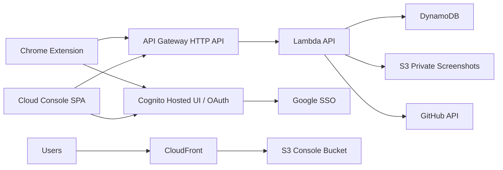

# Cloud Console And Infrastructure Plan

## Cloud Purpose

UXCue Cloud is optional. It exists to sync issues across machines, provide a web console, store screenshots, support GitHub integration, and later support team sharing.

The extension remains useful without cloud.

## Proposed AWS Architecture



## AWS Services

### Cognito User Pool

Use for UXCue Cloud identity.

Reasons:

- Supports social identity providers such as Google.
- Provides standard JWTs for API Gateway/Lambda auth.
- Has a useful free tier for direct/social sign-in monthly active users.

Plan:

- User Pool: `uxcue-{env}`.
- Google social IdP.
- Hosted UI or managed login.
- App clients:
  - Console web client.
  - Extension client with allowed callback URL for `chrome.identity.launchWebAuthFlow`.
- Scopes: `openid`, `email`, `profile`.

Important:

- Google OAuth client credentials are secrets and must not be committed.
- Extension auth callback URL depends on the published extension ID. For dev, use unpacked extension ID or separate dev app client.

### API Gateway HTTP API

Use for cloud API.

Reasons:

- Lower-cost API surface than REST API for simple JSON services.
- Fits Lambda backend.
- Free-tier-friendly for low traffic.

Routes:

- `GET /health`
- `GET /me`
- `GET /projects`
- `POST /projects`
- `GET /projects/{projectId}`
- `PATCH /projects/{projectId}`
- `GET /projects/{projectId}/sessions`
- `POST /projects/{projectId}/sessions`
- `GET /sessions/{sessionId}`
- `PATCH /sessions/{sessionId}`
- `GET /sessions/{sessionId}/issues`
- `POST /sessions/{sessionId}/issues`
- `GET /issues/{issueId}`
- `PATCH /issues/{issueId}`
- `POST /issues/{issueId}/screenshots/{kind}/upload-url`
- `GET /issues/{issueId}/screenshots/{kind}/download-url`
- `POST /sessions/{sessionId}/exports/markdown`
- `POST /sessions/{sessionId}/exports/json`
- `POST /integrations/github/oauth/start`
- `GET /integrations/github/oauth/callback`
- `POST /issues/{issueId}/github/create`
- `POST /issues/{issueId}/github/link`
- `POST /issues/{issueId}/github/refresh`

### Lambda

Use TypeScript Lambda handlers.

Reasons:

- Free-tier-friendly at low request volume.
- Simple deployment.
- No server management.

Implementation:

- One API Lambda for MVP to reduce overhead.
- Separate async cleanup/export Lambda later if needed.
- Keep memory small, for example 256 MB for API.
- Set conservative timeouts, for example 10 seconds for API.

### DynamoDB

Use a single table.

Reasons:

- Free-tier-friendly provisioned capacity is available.
- Serverless and simple.
- Good for user-scoped records.

Billing mode:

- MVP/dev: provisioned capacity, low defaults under free-tier limits.
- Public launch: choose provisioned with autoscaling or on-demand based on observed usage.

Table:

```txt
uxcue-{env}
```

Keys:

- Partition key: `pk`
- Sort key: `sk`
- GSI1 partition key: `gsi1pk`
- GSI1 sort key: `gsi1sk`

Record patterns:

```txt
pk                              sk
USER#{userSub}                  PROFILE
USER#{userSub}                  PROJECT#{projectId}
PROJECT#{projectId}             METADATA
PROJECT#{projectId}             SESSION#{sessionId}
SESSION#{sessionId}             METADATA
SESSION#{sessionId}             ISSUE#{issueId}
ISSUE#{issueId}                 EVENT#{timestamp}
USER#{userSub}                  GITHUB#INSTALLATION
```

Access rules:

- Every request is scoped by Cognito `sub`.
- API must verify the user owns the project/session/issue before read/write.
- No cross-user queries.

### S3

Use private S3 bucket for screenshots and export bundles.

Buckets:

- `uxcue-{env}-screenshots-{accountId}`
- `uxcue-{env}-console-{accountId}`

Screenshot keys:

```txt
users/{userSub}/projects/{projectId}/sessions/{sessionId}/issues/{issueId}/element.png
users/{userSub}/projects/{projectId}/sessions/{sessionId}/issues/{issueId}/viewport.png
```

Controls:

- Block public access.
- Server-side encryption.
- Signed upload and signed download URLs.
- File size limits.
- Lifecycle expiration for free/dev tier, for example 90 days for deleted sessions and optional retention policy for free users.

### CloudFront

Use for the cloud console static SPA.

Plan:

- CloudFront distribution in front of the console S3 bucket.
- Origin access control.
- Custom domain later through Route 53 once product domain is decided.

### Route 53 / DNS

Proposed dev domains:

- `uxcue.tools.ktek.cloud` for console.
- `api.uxcue.tools.ktek.cloud` for API.

This repo already has a DNS delegation model for `ktek.cloud`. Use the existing DNS writer-role pattern after the hosted zone is live.

### CloudWatch

Use for logs, metrics, and alarms.

Minimum:

- Lambda error alarm.
- API Gateway 5xx alarm.
- DynamoDB throttled requests alarm.
- S3 object count/storage dashboard for screenshots.

### AWS Budgets

Required from day one.

Budgets:

- Dev monthly actual cost budget: low fixed threshold.
- Prod monthly actual cost budget: launch threshold.
- Forecasted cost alert.

Notifications:

- Email to owner.
- Optional SNS topic.

## Terraform Layout

Recommended layout:

```txt
terraform/
  uxcue/
    README.md
    versions.tf
    providers.tf
    variables.tf
    outputs.tf
    main.tf
    envs/
      dev.tfvars.example
      prod.tfvars.example
    modules/
      auth/
      api/
      data/
      storage/
      console/
      observability/
      budget/
      dns/
```

Module responsibilities:

- `auth`: Cognito user pool, app clients, Google IdP config placeholders.
- `api`: API Gateway, Lambda, IAM role, log groups.
- `data`: DynamoDB table and indexes.
- `storage`: screenshot/export S3 bucket and policies.
- `console`: static console bucket, CloudFront distribution.
- `observability`: CloudWatch alarms.
- `budget`: AWS budget alerts.
- `dns`: optional Route 53 records using existing DNS role pattern.

State:

- Start with local state for the first spike if needed.
- Move to S3 backend with DynamoDB lock table before shared/prod work.
- Keep backend bootstrap separate from product stack.

## Environment Strategy

### Dev

- Low-cost stack.
- Google OAuth test users only.
- Short screenshot retention.
- Debug logging enabled.
- No public listing dependency.

### Prod

- Separate AWS account or at least separate state/workspace.
- Custom domain.
- Strict CORS allowlist.
- Budget and alarm thresholds.
- Reduced log verbosity.
- Backups/PITR decision for DynamoDB.
- Account deletion workflow.

## Cloud API Error Shape

```json
{
  "error": {
    "code": "issue_not_found",
    "message": "Issue was not found or you do not have access.",
    "requestId": "abc123"
  }
}
```

Codes:

- `unauthorized`
- `forbidden`
- `validation_failed`
- `project_not_found`
- `session_not_found`
- `issue_not_found`
- `sync_conflict`
- `asset_too_large`
- `github_not_connected`
- `github_permission_denied`
- `rate_limited`
- `internal_error`

## Sync Model

MVP uses revision-based optimistic sync.

Each cloud record includes:

```json
{
  "syncRevision": 7,
  "updatedAt": "2026-07-04T20:00:00Z"
}
```

Client update request includes the last known revision.

Conflict behavior:

- If revisions match, update succeeds.
- If revisions differ, API returns `sync_conflict`.
- Extension marks local record as conflict.
- User can choose local wins or cloud wins.

MVP default:

- Create-only conflicts should be rare because local IDs are stable.
- Field-level merge can be postponed.

## Security And Privacy Requirements

- Local-only mode requires no account.
- Cloud sync must be opt-in per project/session or clear global setting.
- Screenshots are private by default.
- Signed screenshot URLs should expire quickly.
- No request/response body capture in MVP.
- No password or cookie capture.
- Metadata extraction should redact obvious secret-looking values in text/attributes.
- Extension should explain each permission.
- GitHub tokens are separate from UXCue account auth.

## Cost Guardrails

Use these controls before any public traffic:

- AWS Budget alarms.
- DynamoDB provisioned capacity caps.
- API Gateway throttling.
- Lambda reserved concurrency for dev.
- S3 object size limit.
- S3 lifecycle expiration for deleted assets.
- Per-user/project issue and storage quotas.
- CloudWatch log retention, for example 14 or 30 days in dev.

## Free-Tier-Aware Defaults

Defaults should be conservative:

- API Lambda memory: 256 MB.
- API Lambda timeout: 10 seconds.
- DynamoDB dev capacity: 5 RCU / 5 WCU.
- Max screenshot size: 3 MB each for MVP.
- Max issues per free project: 250.
- Max screenshot retention for free cloud alpha: 90 days unless exported.
- CloudWatch log retention: 14 days in dev.

Do not promise "free forever." Promise cost-aware architecture.

## Deployment Flow

1. Build API artifact.
2. Build console static assets.
3. `terraform init`.
4. `terraform validate`.
5. `terraform plan -var-file=envs/dev.tfvars`.
6. `terraform apply -var-file=envs/dev.tfvars`.
7. Upload console assets to S3.
8. Invalidate CloudFront if needed.
9. Run API smoke tests.
10. Run console smoke tests.
11. Run extension cloud-sync smoke tests against dev.

## Open Infra Decisions

- Final product domain.
- Whether prod gets a separate AWS account.
- Whether GitHub integration is direct from extension for MVP or brokered by cloud API.
- Whether to use Cognito Hosted UI visually or a custom console sign-in backed by Cognito.
- Screenshot retention and quotas for free users.
